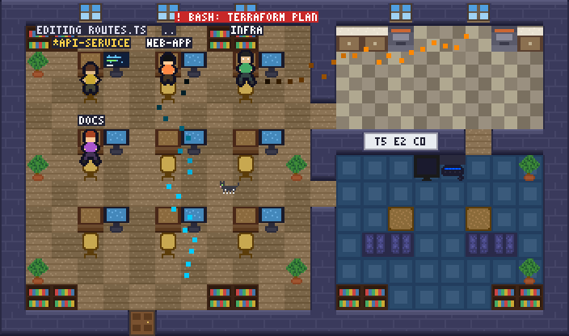
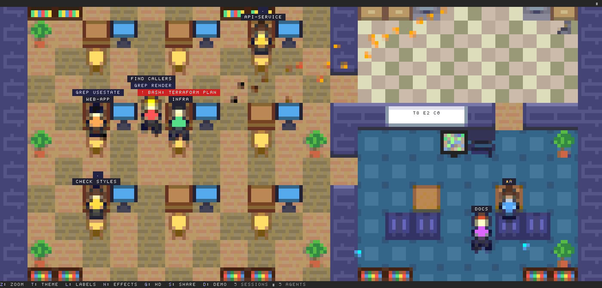
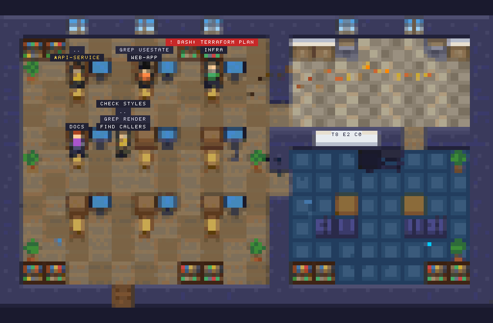
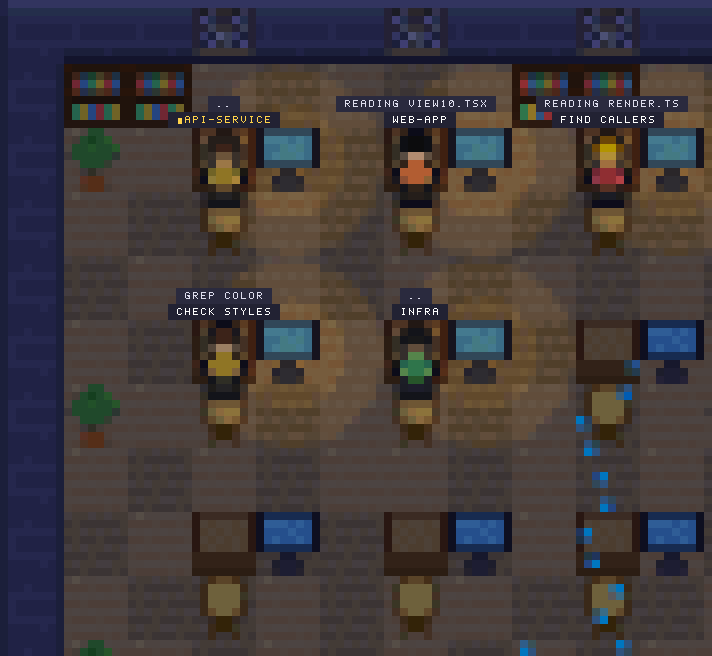
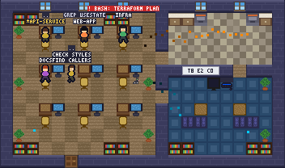
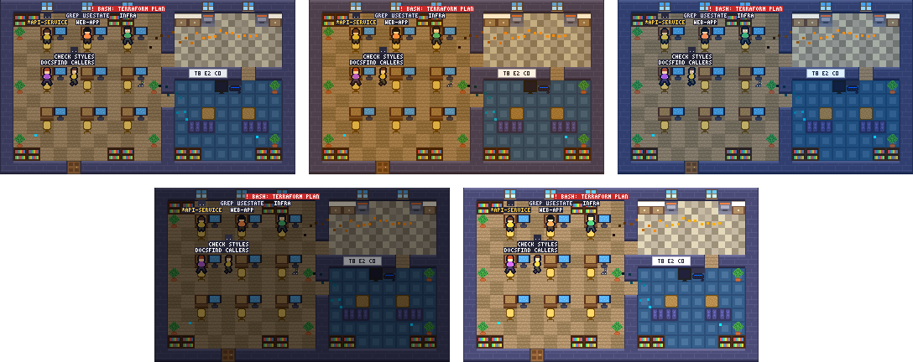
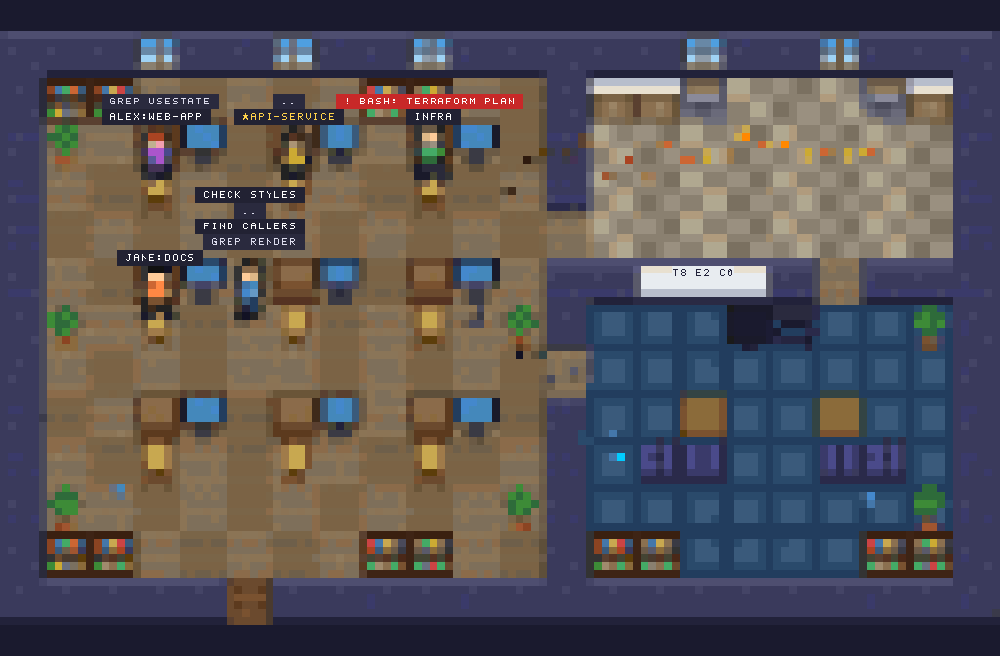
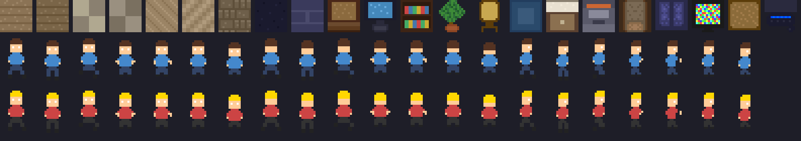

<div align="center">

# pixel-agents

**A pixel-art office where every Claude Code agent on your machine is a character.**

[](https://github.com/Shidfar/pixel-agents-tui/actions/workflows/ci.yml)




[Install](#install) · [Use](#use) · [Sharing](#sharing-with-other-accounts-on-this-mac) · [The binary](#the-standalone-binary) · [How it works](#how-it-works) · [Development](#development)

</div>

What a character does matches what its agent is doing, the moment it happens. It types at its desk while the agent edits a file, stands up with a red bubble when a permission dialog opens, and walks to the couch when the turn ends.

It ships two ways from one TypeScript engine:

- **The plugin.** `/office` opens the office in a pane beside the Claude Code transcript.
- **The binary.** `pixel-agents` draws the same office full-screen in its own terminal.



<sub>`/office demo` in a real Claude Code 2.1.290 session, cropped to the pane. Your own session is marked with ★.</sub>

Tested with Claude Code 2.1.287 through 2.1.290.

## What you see

Every session in every repo shows up, along with its subagents and teammates, for as long as they exist. Nothing is guessed from timers or from reading transcripts: a "waiting for permission" bubble appears exactly when the dialog opens and clears when it is answered, and "idle" means the turn really ended.

| The agent is | The character |
|---|---|
| editing or writing, running a command | types at its desk; the monitor shows code or a terminal, and a bubble shows the file or command |
| reading, searching, thinking | reads at its desk |
| waiting on a permission prompt or a question | stands up, faces you and bobs, with a red `!` or yellow `?` bubble |
| planning | stands at the whiteboard |
| delegating to subagents | leans back at its desk: "waiting on 2 interns" |
| idle | after a few seconds, walks to the couch to watch TV, or gets coffee |
| a subagent that finished | hands over its work, then leaves by the door |

Around the characters the office is alive. The windows follow your local clock and show weather that tracks how full your context window is: clear, clouds, rain, storm, lightning. Desk lamps glow at night, a cat wanders, paper planes fly between agents that message each other, and the whiteboard shows today's totals across all sessions. A `git commit` throws confetti, and a test run ends in a check mark or a puff of smoke.

<table>
  <tr>
    <td width="50%"></td>
    <td width="50%"></td>
  </tr>
  <tr>
    <td align="center"><sub>Noon, zoom <code>fit</code>: the whole office</sub></td>
    <td align="center"><sub>Night at <code>2x</code>, with a storm at 80% context</sub></td>
  </tr>
</table>

### HD pixels and themes

On kitty and Ghostty the office is drawn as a true-pixel image instead of terminal cells (HD mode). It turns on by itself there, and `g` toggles it. Terminals that cannot show images get Claude Code's alt text, so press `g` to go back to cells.



`t` cycles five themes:



<sub>default · warm · cool, then dark · light</sub>

## Install

In Claude Code:

```
/plugin marketplace add Shidfar/pixel-agents-tui
/plugin install pixel-agents@pixel-agents-tui
```

The plugin needs Claude Code 2.1.287 or newer, because it is a hooks module (a mod).

To work on it, clone the repo and start Claude Code with the plugin loaded from the folder:

```
claude --plugin-dir .
```

> [!NOTE]
> If Claude Code says `hooks modules are turned off`, that is a rollout switch on Anthropic's side. It is read from a cached copy at startup and can serve "off" for a single run, so start Claude Code again.

## Use

`/office` toggles the pane and takes one optional word: `/office [demo|share]`. It works in the middle of a turn.

- `/office demo` toggles a scripted crew of four fake sessions with subagents. It's a good way to see everything without waiting for real work.
- `/office share` toggles sharing with other accounts on this Mac and opens the pane; see [Sharing with other accounts on this Mac](#sharing-with-other-accounts-on-this-mac).

The pane asks for about half of your terminal's width, between 56 and 128 columns. If the pane was open when your last session ended, the next session reopens it. Claude Code only does that on its own in terminals 144 columns wide or more (110 once you have opened the pane yourself).

A row of buttons along the bottom of the pane shows the hotkeys. The binary uses the same keys.

| Key | Does | Pane | Binary |
|---|---|:-:|:-:|
| `z` | cycle the zoom: auto, fit, 2x, 1x | ✓ | ✓ |
| `t` | cycle the theme: default, warm, cool, dark, light | ✓ | ✓ |
| `l` | show or hide labels | ✓ | ✓ |
| `n` | show or hide effects | ✓ | ✓ |
| `g` | switch HD pixels on or off | ✓ | |
| `s` | share: turn sharing with other accounts on this Mac on or off | ✓ | |
| `d` | toggle the demo crew | ✓ | ✓ |
| `q` | quit | | ✓ |
| `Esc` | close the pane | ✓ | |
| arrow keys | pan the view when zoomed | | ✓ |

When another session has an agent waiting on a permission prompt or a question, a one-line band above your prompt says so until it is resolved: `⚠ api-service is waiting: Bash(npm publish)`. Each new wait also gets one toast. Your own session is never alerted, because Claude Code already prompts you there.

The Claude Code desktop app has no pane to draw into, so the plugin shows a text roster instead: each session's agents, with their activity and detail.

## Sharing with other accounts on this Mac

macOS keeps each account's home folder private, so by default your office shows only your own sessions. A switch changes that, and it is off by default. With it on, you publish your sessions to `/Users/Shared` and you see the other accounts on this Mac that have also turned it on. With it off, you do neither.

There are three ways in:

- **In the pane,** press `s` (the `share` button).
- **From the prompt,** `/office share` toggles it and opens the pane.
- **In the binary,** `pixel-agents --shared` shows the other accounts. The binary only reads: it never writes to `/Users/Shared`.

The switch is saved with your other preferences.

Sharing is macOS only, because the shared folder is `/Users/Shared`. Elsewhere the switch does nothing, and no error is shown.



<sub>Two of the demo crew shown as other accounts' sessions: <code>alex:web-app</code> and <code>jane:docs</code>.</sub>

### What other accounts can see

For each of your running sessions, other accounts see:

- the session name
- each agent's label and what it is doing
- the short detail on each agent, up to 30 characters
- today's stats

They never see your working folder. The shared file is your own file, listed under [The state folder and your privacy](#the-state-folder-and-your-privacy), with the working directory left blank. The short detail is copied as it is, though: when a path appears early in a command an agent ran or asked to run, such as `cat /Users/jane/notes.txt`, that path is part of the 30 characters and is shared.

The files live in `/Users/Shared/pixel-agents-<account>/sessions/`, one per session, where `<account>` is the name of your home folder. Other accounts can read them but cannot change or delete them.

### How other accounts look in your office

Their sessions are drawn like yours, with the account's short name in front of the session name and the main character's label: `alex:api`. For an account such as `jane.doe`, the short name is the part before the first dot, so you see `jane:api`. Their main character has no ★, which marks your own session. They count in the whiteboard totals and in the pane's session count, which then ends with, for example, `· 2 shared`.

Alerts stay private. Another account's permission prompts and questions never put a band above your prompt and never get a toast, and the binary's waiting count ignores them too.

### Turning it off

A session removes its own shared file when sharing turns off, when it ends, and when `/clear` starts a new conversation. Turning sharing off does this for each of your running sessions within about a second.

<details>
<summary><b>What can be left behind, and when the plugin refuses a shared folder</b></summary>

<br>

Only a session killed without ending cleanly, for example with `kill -9`, leaves its file behind, and that file is not marked as ended. Offices treat it as gone after 20 seconds and other accounts skip it once it is an hour old, but it stays readable in `/Users/Shared` until you delete it. There is no hourly cleanup in the shared folder, and nobody deletes another account's files.

If your folder in `/Users/Shared`, or its `sessions` folder, is a symbolic link, isn't a real folder, belongs to another account, or can be written to by other accounts, the plugin won't use it. If the folder is yours (a real folder that others can write to), delete it with the `rm -rf` line below and turn sharing on again. If it belongs to another account, whether a folder or a symbolic link, only that account or an administrator can remove it, with `sudo rm -rf /Users/Shared/pixel-agents-<your account>`, and then you turn sharing on again.

</details>

To delete your folder by hand:

```
rm -rf /Users/Shared/pixel-agents-$(basename "$HOME")
```

## The standalone binary

```
usage: pixel-agents [--demo] [--shared] [--theme default|warm|cool|dark|light] [--fps 1-30 (10)] [--dir PATH] [--frames N] [--size COLSxROWS]
```

It draws the office full-screen in your terminal's alternate screen, with truecolor half-blocks, and quits on `q`, on Ctrl-C and when stdin closes. It reads the same state folder as the pane (see below), so it shows every session that has the plugin loaded.

- `--demo` runs the scripted crew without any session.
- `--dir` reads a different state folder.
- `--shared` also shows the other accounts on this Mac that have turned sharing on, and only reads; see [Sharing with other accounts on this Mac](#sharing-with-other-accounts-on-this-mac).

Download the binary for your machine from the [releases page](https://github.com/Shidfar/pixel-agents-tui/releases): `pixel-agents-darwin-arm64`, `pixel-agents-darwin-x64`, `pixel-agents-linux-x64` or `pixel-agents-linux-arm64`. Or build it yourself. This needs [Bun](https://bun.sh):

```
npm run build
```

which writes `dist/pixel-agents`.

## How it works

```
Claude Code hook events ──► reducer ──► one snapshot per session ──► ~/.claude/pixel-agents/sessions/<id>.json
                                                                                  │
                                    every open pane, and the binary, read the folder
                                                                                  ▼
                                                      simulation ──► camera ──► renderer ──► cells or HD pixels
```

The plugin listens to Claude Code's own hook events: tool calls starting and finishing, permission requests and denials, subagent spawns, turns starting and completing, compaction, and the session starting and ending. A small reducer turns those events into one snapshot per session. A tool is tracked from its start to its end by id, so "done" is never inferred.

No transcript is ever read.

### The state folder and your privacy

Each session writes only its own file, `~/.claude/pixel-agents/sessions/<sessionId>.json`, at most four times a second plus a heartbeat every five seconds. Every open pane and the binary read the whole folder, which is how one office shows all your sessions.

A file holds:

- the session id, a name (the repo folder, with `-2` added for a second session in the same repo) and the working directory path
- for each agent: its label, its current activity, the name of the tool it is using or waiting on, and a short detail of up to 30 characters (a file basename, the start of a command, search pattern, task description or question, or the host name of a web page it fetched)
- your context fill as a percentage, a few counters (tools, edits, commits, permission prompts, errors) and the last 32 effects

With sharing off, which is the default, the file stays on your machine, under your home directory, and nothing leaves your home folder.

With sharing on, each running session also writes a copy of its file to `/Users/Shared/pixel-agents-<account>/sessions/<sessionId>.json`, on the same schedule, and other accounts on this Mac can read it. The copy is the file above with the working directory path left blank. So everything listed above leaves your home folder except that one path, including the session name, which is the repo folder's name. A short detail is copied as it is, so a path can still leave inside one, when it appears early in a command an agent ran or asked to run. It is still only a file on this Mac. See [Sharing with other accounts on this Mac](#sharing-with-other-accounts-on-this-mac).

A session whose file has not been updated for 20 seconds counts as gone, and its characters walk out. Files older than an hour are deleted by whichever viewer notices them. That is for the folder under your home directory. The shared folder has no such cleanup: each of your sessions removes only its own shared file, when sharing turns off, when it ends and when `/clear` starts a new conversation, and nobody deletes another account's files. Only a session killed without ending cleanly leaves its shared file behind; see [Turning it off](#turning-it-off).

Your preferences (theme, zoom, labels, effects, HD, whether the pane was open, whether sharing is on) are kept in the plugin's own store inside Claude Code. The binary does not read them.

## Development

You need Node (CI runs 24), [Bun](https://bun.sh), TypeScript and Claude Code 2.1.287 or newer:

```
npm i -g bun typescript
npm ci
```

Every check, from the repo root:

```
claude plugin validate --strict .     # manifest, plus static analysis of hooks/register.ts
claude plugin test                    # every tests/*.test.ts, no session or network needed
tsc -p .                              # engine, hooks and tests
tsc -p src/cli                        # the binary
bash tests/cli-smoke.sh               # the binary draws demo frames, reads a shared folder, exits on EOF and compiles
```

CI runs the same checks on every push and pull request. A run of `claude plugin test` that prints `hooks modules are turned off` is the rollout switch above, not a failure, so CI reports it as a skipped step with a warning. On a tag that starts with `v`, CI also builds the four binaries and attaches them to a release.

The code is laid out like this:

```
hooks/register.ts      the only file that touches Claude Code's hook API
src/engine/            the pure engine: truth reducer, world, simulation, renderer, art
src/shell/             what both shells, the mod and the binary, share: the day, the hour, the frame-time cap
src/cli/main.ts        the binary
tests/                 engine and mod tests, plus the binary's smoke test
tools/shot/            screenshot tooling
```

`src/engine` is pure. It has no Node or Bun APIs, no `Date`, no `Math.random` and no timers: time, the local hour, the day and random seeds all come in as parameters, which keeps every test deterministic and lets the same engine run inside Claude Code and inside Bun. Its imports have no file extensions, which Claude Code, Bun and `tsc` accept and Node does not, so any script that imports the engine runs under Bun.

<details>
<summary><b>Screenshots</b></summary>

<br>

Every picture in this README except `pane.png` comes from the engine itself, without a Claude session. Run these from the repo root:

```
bun tools/shot/frames.mjs      # office.gif, fit-noon.png, x2-night-storm.png, hd.png, themes.png and shared.png
bun tools/shot/sheet.mjs       # art-sheet.png, every tile and character frame
```

Both write to `docs/screenshots/`. `npm run shots` runs the first. The engine draws from one fixed palette, so `office.gif` holds every frame's colors exactly, with no dithering.

`pane.png` is a real session. `tools/shot/drive.py` runs an interactive `claude` in a pseudo-terminal of a given size, answers its terminal queries, sends your keystrokes and logs the output. `tools/shot/screen.mjs` replays that log in a headless terminal and paints a PNG:

```
python3 tools/shot/drive.py 200 50 session.log . '[["wait",8],["send","/office demo"],["wait",1],["send","\\r"],["wait",8]]' -- --plugin-dir .
node tools/shot/screen.mjs session.log 200 50 session.png
```

The capture can show your username, plan and folder in Claude Code's header and status line, so crop it to the pane before you share it. Turn HD off with `g` first: the headless terminal cannot show HD images.

The steps are `["wait", seconds]`, `["send", text]` and `["until", text, timeout_seconds]`. Send an escape sequence in one piece, because a split ESC reads as the Esc key. In a folder Claude Code has not seen before, answer its two dialogs first: for the trust dialog `["until","Yes,",15],["wait",1.5],["send","\\u001b[B"],["wait",1],["send","\\r"]`, and for the MCP servers dialog `["until","reject",10],["wait",1],["send","\\u001b"]`.

</details>

## Credits and license

The sprite art (tiles, furniture and characters) derives from [pablodelucca/pixel-agents](https://github.com/pablodelucca/pixel-agents), which is MIT licensed. Its license text is in [THIRD_PARTY_NOTICES.md](THIRD_PARTY_NOTICES.md). The art sheet below shows what was carried over:



The license for this repository's own code has not been decided yet.
